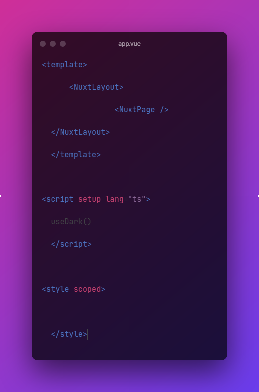

# Auto Screenshotter
This is a simple Deno script that automates the process of taking screenshots of your code making use of [Ray so](https://ray.so) along with [Puppeteer](https://pptr.dev/)

## Installation
### Install Deno
Visit the [Deno website](https://deno.land/) to install Deno.
```bash
git clone
cd auto-screenshotter
```

### Install browser dependencies
Bash:
```bash
PUPPETEER_PRODUCT=chrome deno run -A --unstable https://deno.land/x/puppeteer@16.2.0/install.ts
```
Powershell:
```powershell
$Env:PUPPETEER_PRODUCT = "chrome"
deno run -A --unstable https://deno.land/x/puppeteer@16.2.0/install.ts
```

## Usage
```bash
deno run --allow-read --allow-write --allow-run --allow-env --allow-net main.ts [dir] [options]
```

### Options
```bash
  --help [bool]  Show help
  --out [dir]  Output directory for screenshots (default: ./screenshots)
  --dark [bool]  Use dark theme (default: false)
```

## Example
```bash
deno run --allow-read --allow-write --allow-run --allow-env main.ts D:\Route\To\Your\Code --dark
```

Screenshot example:
